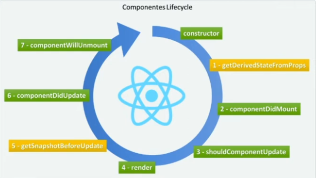

# O que é o React?

## A história do React

O React é uma biblioteca JS para criação de interfaces de usuário. Criado em 2011 pelo time do Facebook, surgiu com o objetivo de otimizar a atualização e a sincronização de atividades simultâneas no feed de notícias da rede social, entre eles chat, status, listagem de contatos e outros.

A princípio, todas essas atividades, chamadas de "estados", tinham uma descrição muito complexa. Com o React, essa descrição torna-se mais simples, bem como também, é simplificada a conexão entre HTML, CSS e JS e todos os componentes de uma página.

Por ter demonstrado grande eficiência, nos anos seguintes o React foi incorporado à interface de outras redes sociais do grupo, como o Instagram e, em 2013, seu código foi aberto à comunidade, dando início a sua popularização.

## Framework x Biblioteca

### Biblioteca

É um recurso para facilitar algum ponto do desenvolvimento. A ideia das bibliotecas é compartilhar soluções por meio de funções ou métodos. Exemplo: se você tiver que fazer um trabalho de matemática da escola, poderá ir a uma biblioteca física, pegar um livro e utilizar as equações desenvolvidas no livro. Ou seja, não será necessário desenvolver as equações desde o início.

Exemplos de biblioteca:
- Moment.js: Biblioteca focada na manipulação e formatação de datas e horas no JavaScript.
- Chart.js: Biblioteca para criar gráficos interativos e personalizáveis em JavaScript.
- Voca: Biblioteca de manipulação de strings no JavaScript, útil para trabalhar com textos.
- mo.js: Biblioteca de animações para web, muito útil para criar interações visuais dinâmicas.
- React: Embora seja mencionado como biblioteca, vale observar que, apesar de ser considerado uma biblioteca, o React tem algumas características de framework por estruturar o desenvolvimento de interfaces de usuário de forma abrangente.

### Framework

O framework nada mais é do que uma ferramenta que vai te ajudar a ter como único objetivo focar em desenvolver o projeto, não em detalhes de configurações. São estruturas que oferecem uma base e um conjunto de ferramentas e regras para que o desenvolvedor possa focar no desenvolvimento do projeto sem se preocupar com muitos detalhes de configuração. Ao contrário das bibliotecas, que são utilizadas pelo código do desenvolvedor, nos frameworks, o fluxo é invertido: o framework controla como o código do desenvolvedor será executado.

Exemplos de framework:
- Angular: Um framework completo de front-end baseado em TypeScript para criar aplicações web dinâmicas e robustas.
- Ionic: Framework para desenvolvimento de aplicativos móveis híbridos, que permite criar aplicações usando tecnologias web como HTML, CSS e JavaScript.
- Next.js: Um framework de React que facilita a criação de aplicações web otimizadas com renderização do lado do servidor (SSR) e geração de páginas estáticas (SSG).
- Express: Um framework minimalista para Node.js, muito utilizado para construir APIs e servidores web.
- LoopBack: Um framework para Node.js focado na construção de APIs REST, permitindo integrar com diversas fontes de dados e gerar automaticamente endpoints de API.
- Vuex: Embora seja usado com o framework Vue.js, o Vuex é uma biblioteca de gerenciamento de estado centralizado para aplicações Vue.js. Ele fornece uma maneira eficiente de gerenciar o estado da aplicação.

## Ciclo de vida de um componente

### Continuação da Seção, com o primeiro projeto, no caminho "/Dio/dio"